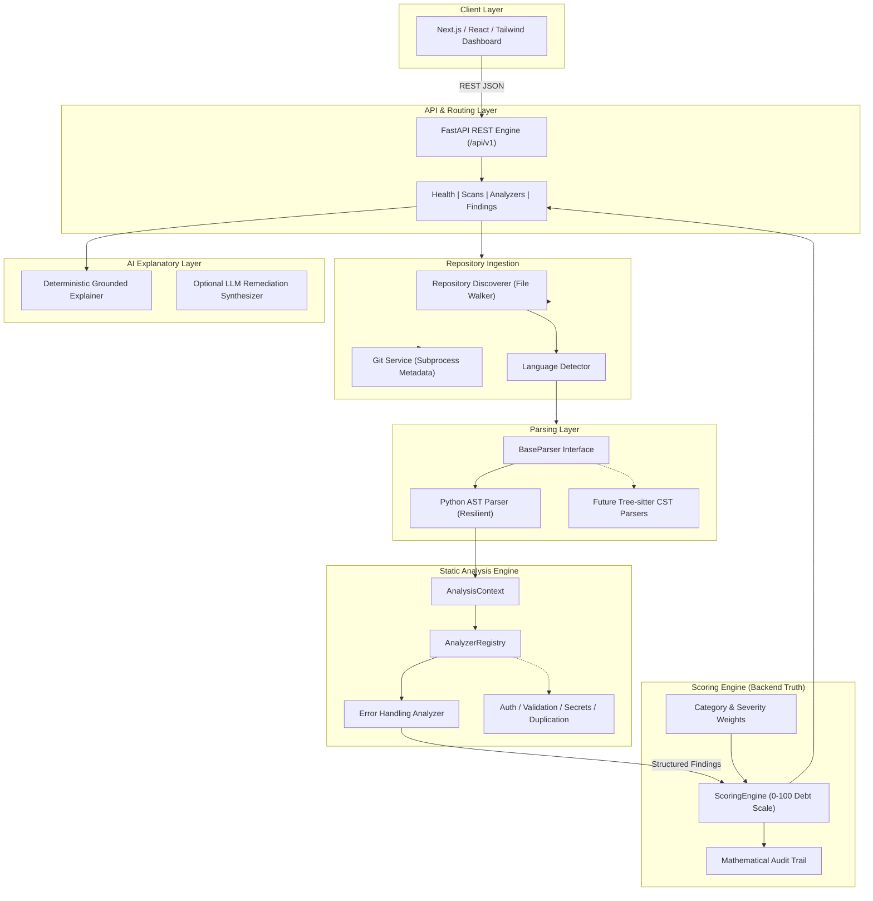

# Entropy System Architecture

## 1. System Overview

Entropy is an architectural security-debt platform designed specifically for modern AI-assisted software development. Rather than focusing solely on active, live vulnerabilities that exist today, Entropy analyzes **Architectural Security Debt**: architectural inconsistencies, structural duplications, swallowed exceptions, and fragmented security controls that accumulate risk over time.

---

## 2. High-Level Architecture



---

## 3. Strict Separation of Concerns

The architecture strictly decouples 8 distinct layers:

| Layer | Responsibility | Invariant |
| :--- | :--- | :--- |
| **Ingestion** | Traverses directory, applies `.gitignore`, extracts git branch/commit. | Never executes untrusted repository code. |
| **Parsing** | Transforms raw source text into abstract syntax trees (AST/CST). | Fails gracefully on syntax errors without crashing the scan. |
| **Analysis** | Detects observable syntactic and structural debt patterns. | Must produce structured `Finding` objects traceable to exact lines. |
| **Finding Generation** | Encapsulates rule ID, severity, confidence, verbatim code evidence, impact, and recommendation. | Generates stable SHA-256 fingerprints for cross-commit tracking. |
| **Scoring** | Computes the 0–100 Architectural Security Debt Score and 7 category breakdowns. | Consumes findings only; never inspects source code directly. |
| **AI Explanation** | Synthesizes contextual architectural rationale and remediation diffs. | Never invents or fabricates findings; strictly explains static analysis results. |
| **API** | Exposes versioned REST endpoints (`/api/v1/*`). | Zero analysis or scoring logic directly in route handlers. |
| **Frontend** | Renders interactive dashboard, category matrices, and code viewers. | **Never** computes or alters debt scores. Backend is the sole source of truth. |

---

## 4. Parser Architecture & Multi-Language Roadmap

The parsing subsystem is governed by the `BaseParser` abstract contract:

```python
class BaseParser(ABC):
    @abstractmethod
    def can_parse(self, language: SupportedLanguage) -> bool: ...

    @abstractmethod
    def parse(self, discovered_file: DiscoveredFile) -> ParsedFile: ...
```

### Phase 0: Python AST
Uses the Python standard library `ast` module with resilient syntax error handling. Line numbers, column offsets, and symbol hierarchies (functions, methods, classes) are captured cleanly.

### Phase 1+: Tree-sitter Multi-Language Architecture
Tree-sitter provides concrete syntax tree (CST) parsers for TypeScript, JavaScript, Go, and Python. Because `BaseParser` produces a uniform `ParsedFile` containing code evidence, line maps, and AST root references, tree-sitter parsers can be dropped in without changing the analyzer orchestration.

---

## 5. Persistence Strategy

- **Phase 0 (Foundation)**: In-memory repository scan store for fast, dependency-free local development and test execution.
- **Phase 1+ (Production)**: SQLAlchemy / SQLModel layer backed by PostgreSQL:
  - `repositories` table (repo URL, branch, default configurations).
  - `scans` table (scan ID, commit hash, duration, status, aggregated score).
  - `findings` table (foreign key to scan, file location, severity, fingerprint).
  - `rules` table (rule definitions, category mappings, weights).

---

## 6. Extensibility: Authoring a New Analyzer

To add a new analyzer to Entropy:

1. Create a module under `backend/app/analyzers/rules/<category>/<analyzer_name>.py`.
2. Subclass `BaseAnalyzer`.
3. Declare `RuleDefinition`s with clear impact and remediation templates.
4. Implement `analyze(self, context: AnalysisContext) -> list[Finding]`.
5. Register the analyzer in `AnalyzerRegistry` using `registry.register(YourAnalyzer())`.
6. Add unit tests verifying:
   - Detection of the problematic pattern.
   - Clean code yielding zero false positives.
   - Graceful handling of unparseable files.
